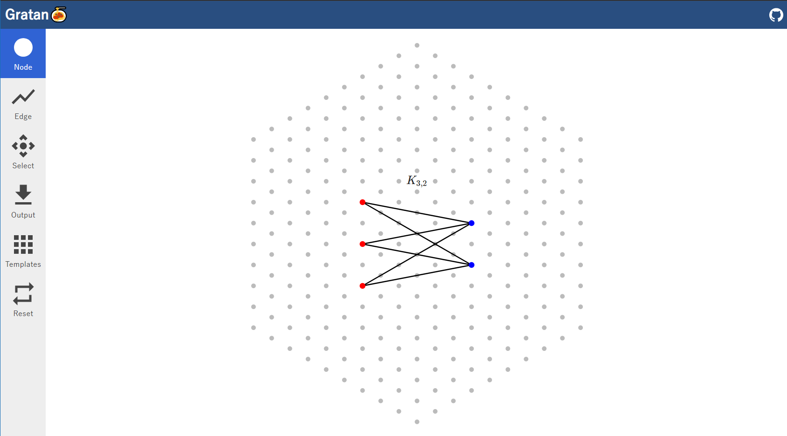

# Gratan🍝 - An easy to use graphing tool

You can easily create graphs for use in graph theory, such as complete graphs and bipartite graphs, and convert them to Latex formats.
Site - https://syakoo.github.io/gratan/

## Features

- Adding and editing nodes and edges **with a click**
- Converting graphs to **Tikz** format
